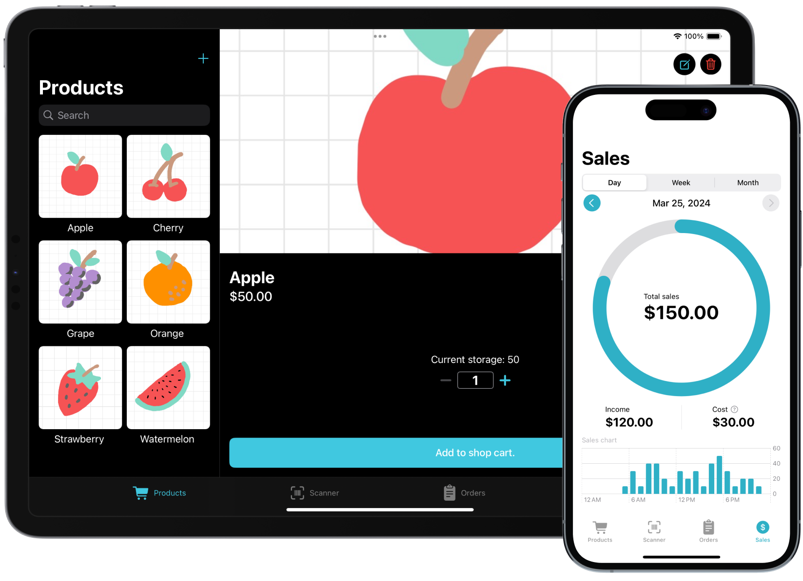

<h1 align="center">SimPOS</h1>

---

<h3 align="center">Sometimes Simple is all people needs.</h3>

 WWDC24 Swift Student Challenge Winning Project

## About

SimPOS is a user-friendly point-of-sale system designed to streamline order and sales management for vendors and retailers. It offers essential features such as storage management, scanner integration, and comprehensive sales summary functions.

## Technologies

- Swift
- SwiftUI
- SwiftData
- UiKit
- AVFoundation

## Features

- [ ] Point-of-sale system
- [ ] Barcode scanner
- [ ] Order status/ detail tracking
- [ ] (Daily | Weekly | Monthly) sales analysis with chart
